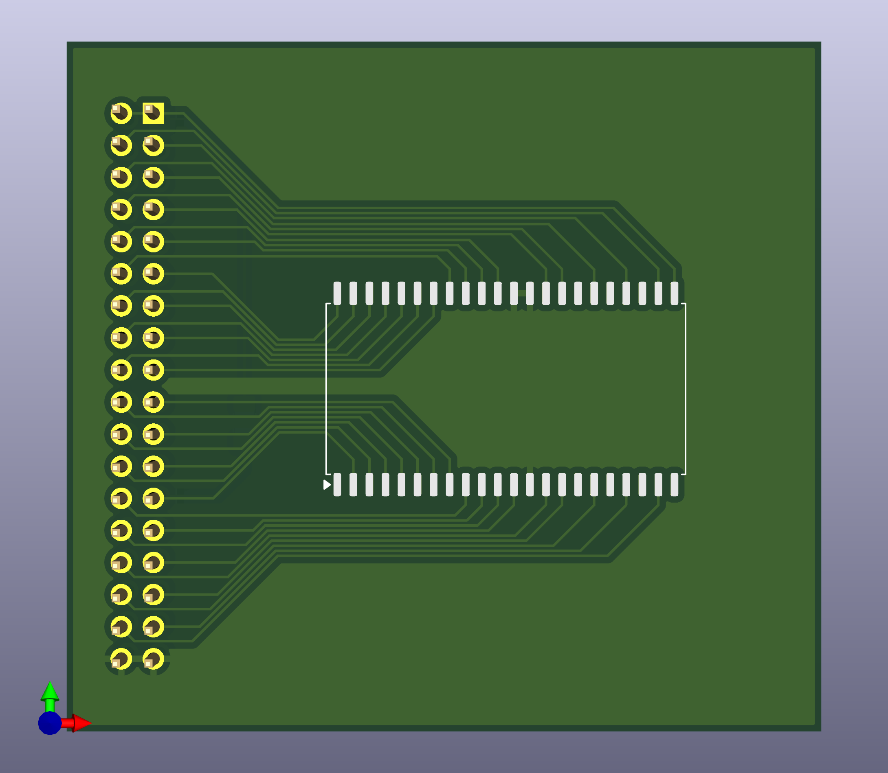
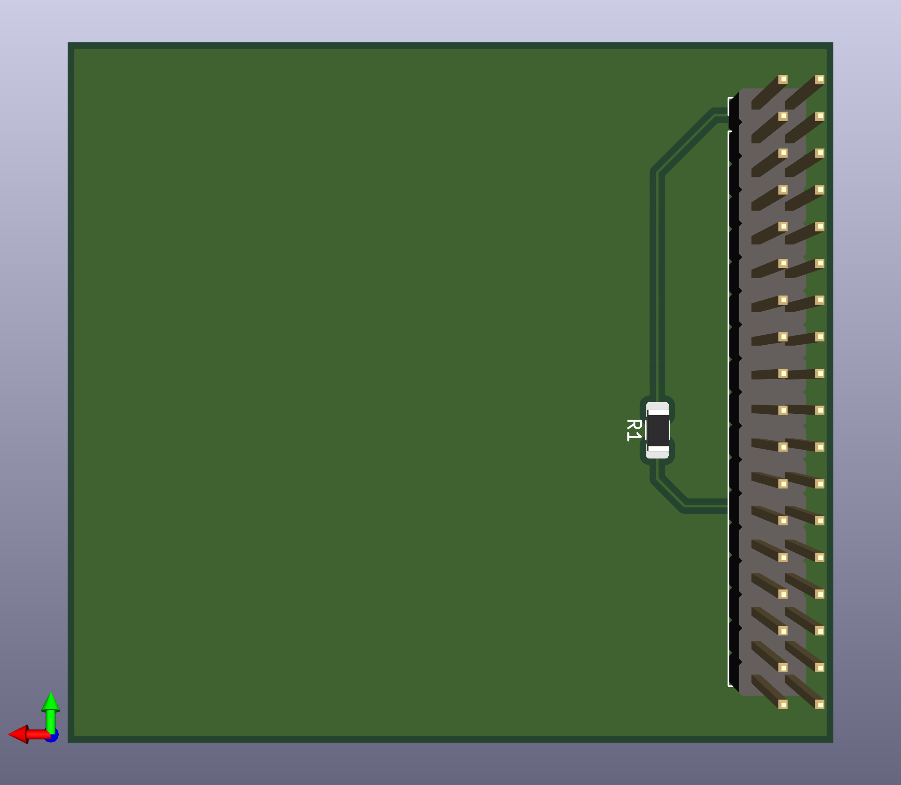

## Am29F400B Arduino Flasher

This is a script for reading, erasing and writing the AMD Am29F400B flash memory chips using an Arduino MEGA.  
These chips were used in many ECUs, TCUs and other kinds of control units in combination with the CR167 CPU from Siemens/Infineon.

### Supported Chips

```
Am29F400BT                  | Top Boot Sector
Am29F400BB                  | Bottom Boot Sector
```

***

## Software

The PC side script needs to be executed using Python 3 in a shell. (https://www.python.org/downloads/)

Flash the `arduino.ino` to an Arduino MEGA.

### Available Commands

```
-r <file>                   | Read full
-r <file> <start> <size>    | Read partial
-r <file> <sector>          | Read sector
-w <file>                   | Write full
-w <file> <start> <size>    | Write partial (without erasing)
-w <file> <sector>          | Write sector
-e                          | Erase full
-e <sector>                 | Erase sector
-v                          | Prints sector protection states
```

***

### Reading

Read all 512KB of data:
```
python3 main.py -r dump.bin
```

Read only data in a specific sector (e.g. SA1, see table below):
```
python3 main.py -r dump.bin 1
```

Read only a specific range (e.g. address 0x10, size 0x200, decimal and hex possible):
```
python3 main.py -r dump.bin 1 0x10 0x200
```
```
python3 main.py -r dump.bin 1 16 512
```
***

### Writing

Write to all 512KB of available space:
```
python3 main.py -w new_data.bin
```

Write only to a specific sector (e.g. SA3, see table below): 
```
python3 main.py -w new_data.bin 3
```

Write only to a specific range (e.g. address 0x20, size 0x100, decimal and hex possible): 
```
python3 main.py -r new_data.bin 1 0x20 0x00
```
```
python3 main.py -r new_data.bin 1 32 256
```

**Attention:**  
Writing to a specific range will not erase the data beforehand, because it is only possible to erase a whole sector.  
So this only works if the bits you want to change are 1.   
You can only change bits back from 0 to 1 with erasing.

Also, any writing can only be done if the sector is unprotected.  
Check the sector protection states using the `-v` command.

***

### Erasing
Erase all sectors (SA0 - SA10)
```
python3 main.py -e
```

Erase only a specific sector (e.g. SA5, see table below)
```
python3 main.py -e 5
```

**Attention:**  
Erasing can only be done if the sector is unprotected.  
Check the sector protection states using the `-v` command.

***

## Hardware

Included is a simple PCB that adapts the 36 pin connector of the Arduino MEGA to the SO44 footprint.  
Use a 1206 1kΩ resistor to pull up the RY/BY# signal. (only needed for erasing and writing)

The gerber file is ready for ordering at JLCPCB.






***

## Sector Layouts
The chip is seperated into 11 sectors.  
Sizes and addresses of these sectors are dependent on the variant.  
Hardware and software is designed to operate in *byte mode*.  
Values would differ in *word mode*.

### Am29F400TT

| Sector | Address | Size    |
|--------|---------|---------|
| SA0    | 0x00000 | 0x10000 |
| SA1    | 0x10000 | 0x10000 |
| SA2    | 0x20000 | 0x10000 |
| SA3    | 0x30000 | 0x10000 |
| SA4    | 0x40000 | 0x10000 |
| SA5    | 0x50000 | 0x10000 |
| SA6    | 0x60000 | 0x10000 |
| SA7    | 0x70000 | 0x8000  |
| SA8    | 0x78000 | 0x4000  |
| SA9    | 0x7a000 | 0x2000  |
| SA10   | 0x7c000 | 0x4000  |

### Am29F400BT

| Sector | Address | Size    |
|--------|---------|---------|
| SA0    | 0x00000 | 0x4000  |
| SA1    | 0x04000 | 0x2000  |
| SA2    | 0x06000 | 0x2000  |
| SA3    | 0x08000 | 0x8000  |
| SA4    | 0x10000 | 0x10000 |
| SA5    | 0x20000 | 0x10000 |
| SA6    | 0x30000 | 0x10000 |
| SA7    | 0x40000 | 0x10000 |
| SA8    | 0x50000 | 0x10000 |
| SA9    | 0x60000 | 0x10000 |
| SA10   | 0x70000 | 0x10000 |